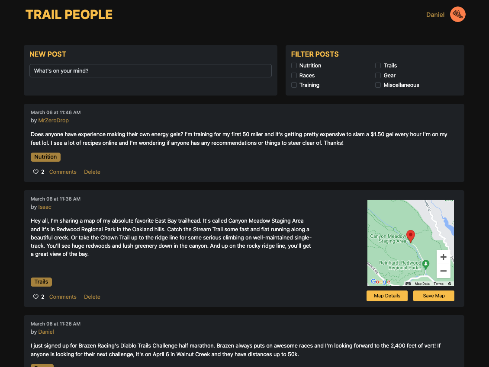

# Trail People

## Table of Contents
1. [Description](#description)
1. [Project Progress](#project-progress)
2. [Screenshots](#screenshots)
3. [Tech Stack](#tech-stack)
4. [Models](#models)
5. [API Endpoints](#api-endpoints)
6. [Integrations](#integrations)
7. [License](#license)

## Description

Trail People is a platform designed for trail runners, providing a social media experience where users can connect, share, and explore their passion for trail running. Features include:

- **Social Media Platform**: Users can post updates, comment on posts, and like content shared by other users. The platform includes search and filter functionality for discovering and exploring content within the social media feed.

- **Trail Map Creation and Sharing**: Trail People allows users to create, share, and save trail maps for their favorite trail runs. This feature enables runners to discover new trails, plan their runs, and share their experiences with others.

Trail People aims to provide a comprehensive platform where the trail running
community can meet and engage!

## Project Progress

Trail People is currently fully functioning and deployed, but I'm working on improving a couple aspects of the project:

- **Code Refactoring:**
  - Refactoring code to improve cleanliness and introduce more reusable components in React for better maintainability, scalability, and readability.

- **Integration of Redux:**
  - Planning to introduce Redux for more effective state management, enhancing the application's stability and performance.

## Screenshots

## Tech Stack

### Frontend:
- **JavaScript**
- **React**
- **Google Maps JavaScript API**

### Backend:
- **Python**
- **Django**

### DevOps:
- **Heroku** (for backend deployment)
- **Netlify** (for frontend deployment)

### Version Control:
- **Git**
- **GitHub**

## Models

This project consists of the following data models divided into three Django apps: accounts, activities, and content. Each app contains models representing different aspects of the Trail People project.

### Accounts

#### CustomUser

| Field            | Type          |
|------------------|---------------|
| id               | PrimaryKey    |
| bio              | TextField     |
| avatar           | CharField     |
| profile_picture  | ImageField    |

### Activities

#### Trail

| Field          | Type                   |
|----------------|------------------------|
| id             | PrimaryKey             |
| creator        | ForeignKey(CustomUser) |
| name           | CharField              |
| description    | TextField              |
| image          | ImageField             |
| coordinates    | JSONField              |
| created_at     | DateTimeField          |
| updated_at     | DateTimeField          |

#### SavedTrail

| Field     | Type                   |
|-----------|------------------------|
| id        | PrimaryKey             |
| user      | ForeignKey(CustomUser) |
| trail     | ForeignKey(Trail)      |
| saved_at  | DateTimeField          |

### Content

#### Tag

| Field  | Type          |
|--------|---------------|
| id     | PrimaryKey    |
| name   | CharField     |

#### Post

| Field          | Type                    |
|----------------|-------------------------|
| id             | PrimaryKey              |
| author         | ForeignKey(CustomUser)  |
| tags           | ManyToManyField(Tag)    |
| title          | CharField               |
| content        | TextField               |
| image          | ImageField              |
| created_at     | DateTimeField           |
| updated_at     | DateTimeField           |
| status         | CharField               |

#### Comment

| Field          | Type                    |
|----------------|-------------------------|
| id             | PrimaryKey              |
| author         | ForeignKey(CustomUser)  |
| post           | ForeignKey(Post)        |
| content        | TextField               |
| image          | ImageField (Optional)   |
| created_at     | DateTimeField           |
| updated_at     | DateTimeField           |

#### PostLike

| Field          | Type                    |
|----------------|-------------------------|
| id             | PrimaryKey              |
| author         | ForeignKey(CustomUser)  |
| post           | ForeignKey(Post)        |
| created_at     | DateTimeField           |

#### CommentLike

| Field          | Type                    |
|----------------|-------------------------|
| id             | PrimaryKey              |
| author         | ForeignKey(CustomUser)  |
| comment        | ForeignKey(Comment)     |
| created_at     | DateTimeField           |

## API Endpoints

This section outlines the API endpoints available in the Trail People platform, organized by functional area.

### Accounts

#### User Profile

- **GET /accounts/profiles/{pk}/**
  - Retrieve details of a user profile. (Email address remains private.)

- **PUT /accounts/profiles/{pk}/**
  - Update details of a user profile. Authenticated users can only update their own profile.

#### User Authentication

- **POST /accounts/login/**
  - Authenticate a user.

- **POST /accounts/logout/**
  - Log out an authenticated user.

- **POST /accounts/signup/**
  - Register a new user.

#### Current User

- **GET /accounts/current_user/**
  - Fetch the current authenticated user's details.

### Content

#### Tags

- **GET /content/tags/**
  - List all tags.

#### Posts

- **GET /content/posts/**
  - Retrieve a paginated list of posts.

- **POST /content/posts/**
  - Create a new post. Authenticated users only.

- **GET /content/posts/{pk}/**
  - Retrieve details of a specific post.

- **PUT /content/posts/{pk}/**
  - Update a specific post. Only the author of the post.

- **DELETE /content/posts/{pk}/**
  - Delete a specific post. Only the author of the post.

#### Comments

- **GET /content/posts/{post_pk}/comments/**
  - List comments for a specific post.

- **POST /content/posts/{post_pk}/comments/**
  - Add a new comment to a post. Authenticated users only.

- **GET /content/posts/{post_pk}/comments/{pk}/**
  - Retrieve details of a specific comment.

- **PUT /content/posts/{post_pk}/comments/{pk}/**
  - Update a specific comment. Only the author of the comment.

- **DELETE /content/posts/{post_pk}/comments/{pk}/**
  - Delete a specific comment. Only the author of the comment.

#### Likes

- **GET /content/posts/{post_pk}/check-like/**
  - Check if the current user has liked a specific post.

- **POST /content/posts/{post_pk}/post-likes/**
  - Like a specific post.

- **DELETE /content/posts/{post_pk}/post-likes/{pk}/**
  - Remove a like from a post.

- **GET /content/posts/{post_pk}/comments/{comment_pk}/check-comment-like/**
  - Check if the current user has liked a specific comment.

- **POST /content/posts/{post_pk}/comments/{comment_pk}/comment-likes/**
  - Like a specific comment.

- **DELETE /content/posts/{post_pk}/comments/{comment_pk}/comment-likes/{pk}/**
  - Remove a like from a comment.

### Trails

#### All Trails

- **GET /trails/**
  - List all trails with pagination.

- **POST /trails/**
  - Create a new trail. Authenticated users only.

- **GET /trails/{pk}/**
  - Retrieve details of a specific trail.

- **PUT /trails/{pk}/**
  - Update a specific trail. Only the creator of the trail.

- **DELETE /trails/{pk}/**
  - Delete a specific trail. Only the creator of the trail.

#### Saved Trails

- **GET /trails/saved_trails/**
  - List all saved trails for the authenticated user.

- **POST /trails/saved_trails/{trail_id}/**
  - Save a trail to the authenticated user's list of saved trails.

- **DELETE /trails/saved_trails/{trail_id}/**
  - Remove a trail from the authenticated user's list of saved trails.

## Integrations

### Google Maps JavaScript API

The Trail People project integrates the Google Maps JavaScript API to enable interactive map functionalities. This integration allows users to:

- **Map Interaction:** Users can click on the map to place markers, indicating the starting point of new trails.
- **Map Visualization:** The API provides a visually appealing map interface for users to view and interact with.

## License
This project is licensed under the [Apache License 2.0](./LICENSE). See the [LICENSE](./LICENSE) file for details.
